# Phase 1 – Software Architecture: Garba Connect

This document defines **what** Garba Connect is, **how** components interact, and **why** each architectural choice was made. Implementation begins in Phase 2; Phase 1 is the contract for database, APIs, frontend modules, security, and deployment.

---

## 1. Product scope and domain model

### 1.1 Core user journeys

| Journey | Description | Architectural implication |
|---------|-------------|---------------------------|
| **Onboard** | Register, verify email (optional v1), complete profile with photo and venue preferences | Auth service, profile aggregate, file upload |
| **Discover** | See attendees “nearby” (geolocation + optional venue/event context) | PostGIS or lat/lng queries, privacy controls, rate limits |
| **Connect** | Send/receive connection requests; accept/decline/block | State machine for `ConnectionRequest`, idempotent APIs |
| **Chat** | Real-time messaging only between **mutually accepted** connections | WebSocket + persistence; authorization on every message |
| **Notify** | In-app (and future push) for requests, accepts, messages | Event-driven notifications table + WebSocket fan-out |

### 1.2 Bounded contexts (DDD-lite)

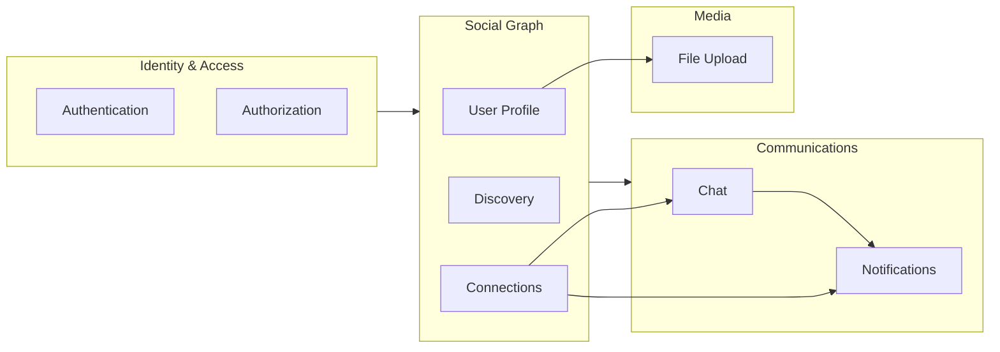

**Decision:** Monolithic Spring Boot deployment for v1 (single deployable, clear modules/packages). Split into services only when traffic or team size demands it—connection and chat share strong consistency needs for “can user A message user B?”.

---

## 2. High-level architecture

### 2.1 Runtime topology (production)

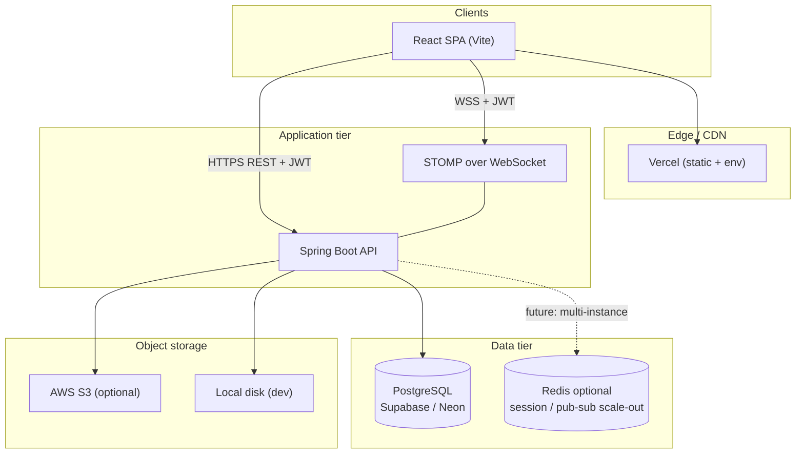

### 2.2 Request path (REST)

1. Browser loads SPA from Vercel; `VITE_API_URL` points to backend (Render/AWS).
2. Axios attaches `Authorization: Bearer <accessToken>` on API calls.
3. Spring Security `JwtAuthenticationFilter` validates signature, expiry, and loads `UserDetails`.
4. Controller → Service → Repository → PostgreSQL.
5. Standard error envelope: `{ "timestamp", "status", "code", "message", "path", "errors?" }`.

### 2.3 Cross-cutting concerns

| Concern | Approach |
|---------|----------|
| **CORS** | Allow Vercel origin(s); credentials if using cookies (v1: Bearer in header, simpler CORS) |
| **Validation** | Jakarta Bean Validation on DTOs; `@ControllerAdvice` for 400/409 |
| **Idempotency** | Connection requests keyed by `(requesterId, targetId)` unique constraint |
| **Observability** | Spring Actuator `/actuator/health`; structured logs (JSON in prod); correlation ID header `X-Request-Id` |
| **API versioning** | `/api/v1/...` prefix from day one |

---

## 3. Frontend architecture

### 3.1 Layered structure (feature-first)

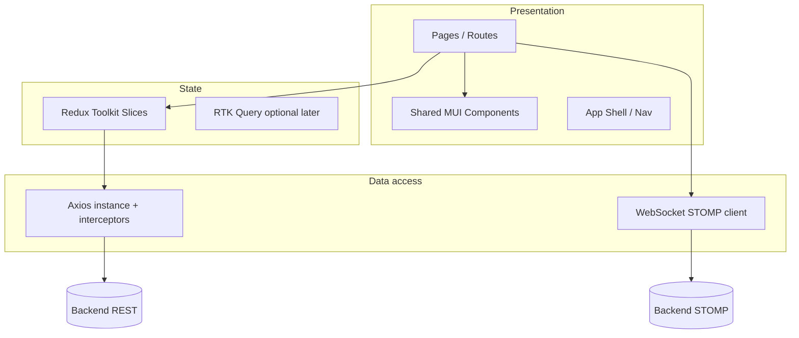

### 3.2 Folder structure (target)

```
frontend/src/
├── app/                 # store, router, theme, providers
├── features/
│   ├── auth/
│   ├── profile/
│   ├── discovery/
│   ├── connections/
│   ├── chat/
│   └── notifications/
├── shared/
│   ├── components/      # Button, Avatar, EmptyState, ErrorBoundary
│   ├── hooks/           # useAuth, useGeolocation, useStomp
│   ├── api/             # axios client, token refresh
│   └── utils/
└── assets/
```

### 3.3 Routing and access control

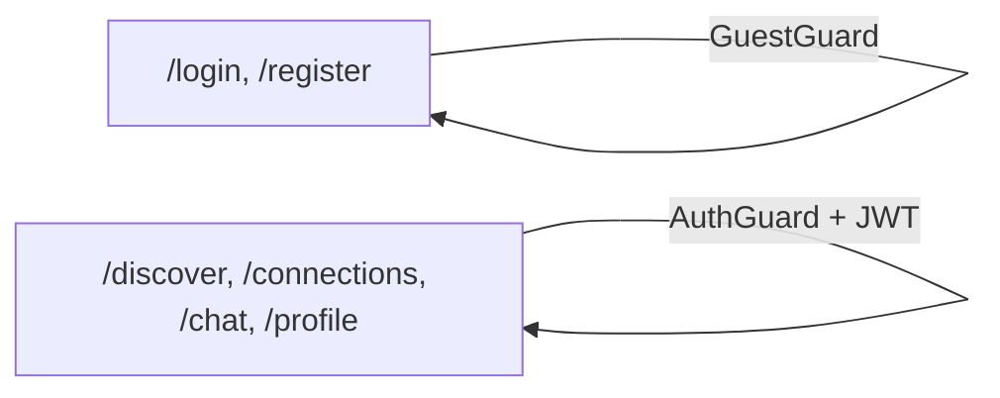

**Decision:** Access token in **memory** (Redux) + refresh token in **httpOnly cookie** (preferred) OR both in memory for MVP with short TTL—documented in Phase 2. Avoid localStorage for refresh tokens.

### 3.4 UI/UX principles (Garba/Navratri context)

- **Warm, festive palette** without sacrificing WCAG AA contrast (MUI theme: deep magenta/orange accents, neutral surfaces).
- **Mobile-first**: discovery and chat are thumb-friendly; bottom nav on small screens.
- **Trust & safety**: clear connection state labels; block/report entry points on profiles.
- **Location transparency**: explicit “sharing location for this session” toggle; never silent background tracking without consent.

### 3.5 State ownership

| State | Owner | Notes |
|-------|--------|------|
| Session, user id | `auth` slice | Hydrated after login |
| Profile form | Local + slice on save | Optimistic UI optional |
| Discovery list | `discovery` slice | Paginated, stale-while-revalidate |
| Connections | `connections` slice | Sync with server on focus |
| Active conversation messages | `chat` slice | Merge WebSocket events |
| Unread counts | `notifications` slice | Updated via WS + REST |

---

## 4. Backend architecture

### 4.1 Package structure (hexagonal / clean-ish)

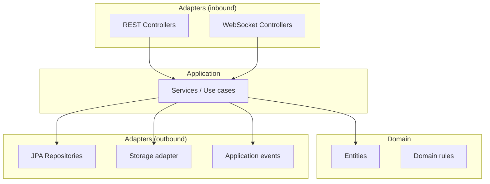

```
backend/src/main/java/com/garbaconnect/
├── config/           # Security, WebSocket, CORS, Jackson
├── security/         # JWT, UserDetails, filters
├── api/v1/           # Controllers + DTOs
├── domain/           # Entities, enums
├── repository/
├── service/
├── websocket/
├── storage/          # Local + S3 implementations
└── exception/        # Global handler
```

### 4.2 Layer responsibilities

| Layer | Responsibility |
|-------|----------------|
| **Controller** | HTTP mapping, DTO validation, no business logic |
| **Service** | Transactions, authorization checks, orchestration |
| **Repository** | Persistence queries; custom `@Query` for geo |
| **Security** | Authentication only in filter; **authorization in services** (“can send request to user?”) |

### 4.3 Key domain rules (enforced in services)

1. **Chat allowed iff** connection status = `ACCEPTED` and neither party blocked the other.
2. **One pending request** per ordered pair (requester → target); resend after decline is a new policy (configurable: cooldown).
3. **Discovery** excludes: self, blocked users, users who opted out of discovery, non-visible profiles.
4. **Location** stored as last known point + `updated_at`; optional fuzzing (grid rounding) for privacy.

---

## 5. Database architecture

### 5.1 ER diagram (logical)

```mermaid
erDiagram
  USERS ||--o| USER_PROFILES : has
  USERS ||--o{ USER_LOCATIONS : updates
  USERS ||--o{ CONNECTION_REQUESTS : sends
  USERS ||--o{ CONNECTION_REQUESTS : receives
  USERS ||--o{ BLOCKS : initiates
  CONNECTIONS ||--|| USERS : user_a
  CONNECTIONS ||--|| USERS : user_b
  CONNECTIONS ||--o{ CONVERSATIONS : enables
  CONVERSATIONS ||--o{ MESSAGES : contains
  USERS ||--o{ NOTIFICATIONS : receives
  USERS ||--o{ REFRESH_TOKENS : owns
  USER_PROFILES ||--o| MEDIA_ASSETS : avatar

  USERS {
    uuid id PK
    string email UK
    string password_hash
    enum status
    timestamptz created_at
  }
  USER_PROFILES {
    uuid user_id PK_FK
    string display_name
    text bio
    string city
    uuid avatar_asset_id FK
    boolean discoverable
  }
  USER_LOCATIONS {
    uuid user_id PK_FK
    decimal latitude
    decimal longitude
    geography point "PostGIS optional"
    timestamptz updated_at
  }
  CONNECTION_REQUESTS {
    uuid id PK
    uuid requester_id FK
    uuid target_id FK
    enum status "PENDING|ACCEPTED|DECLINED|CANCELLED"
    timestamptz created_at
  }
  CONNECTIONS {
    uuid id PK
    uuid user_a_id FK
    uuid user_b_id FK
    timestamptz connected_at
  }
  CONVERSATIONS {
    uuid id PK
    uuid connection_id FK UK
  }
  MESSAGES {
    uuid id PK
    uuid conversation_id FK
    uuid sender_id FK
    text body
    enum status "SENT|DELIVERED|READ"
    timestamptz created_at
  }
  NOTIFICATIONS {
    uuid id PK
    uuid user_id FK
    enum type
    jsonb payload
    boolean read
    timestamptz created_at
  }
  BLOCKS {
    uuid blocker_id FK
    uuid blocked_id FK
    timestamptz created_at
  }
  MEDIA_ASSETS {
    uuid id PK
    string storage_key
    string content_type
    bigint size_bytes
    uuid owner_id FK
  }
  REFRESH_TOKENS {
    uuid id PK
    uuid user_id FK
    string token_hash
    timestamptz expires_at
    timestamptz revoked_at
  }
```

### 5.2 Indexing strategy

| Query pattern | Index |
|---------------|--------|
| Login by email | `UNIQUE (email)` |
| Nearby users | GiST on `geography(point)` or composite `(latitude, longitude)` + bounding box pre-filter |
| Pending requests for user | `(target_id, status)` |
| Messages by conversation | `(conversation_id, created_at DESC)` |
| Unread notifications | `(user_id, read, created_at DESC)` |

**Decision:** Use **UUID** primary keys (no enumerable user ids). Normalize connection pair as `user_a_id < user_b_id` in `CONNECTIONS` for uniqueness `(user_a_id, user_b_id)`.

### 5.3 Migrations

- **Flyway** (`db/migration/V1__...sql`) in Spring Boot; same scripts for local Docker Postgres and Supabase/Neon.

---

## 6. Authentication flow

### 6.1 Token model

| Token | Lifetime | Storage (client) | Storage (server) |
|-------|----------|------------------|------------------|
| Access JWT | 15 min | Memory (Redux) | Stateless (signed) |
| Refresh token | 7–30 days | httpOnly Secure cookie (target) | Hash in `REFRESH_TOKENS`, rotatable |

JWT claims: `sub` (user id), `email`, `iat`, `exp`, optional `roles`.

### 6.2 Sequence: register / login / refresh

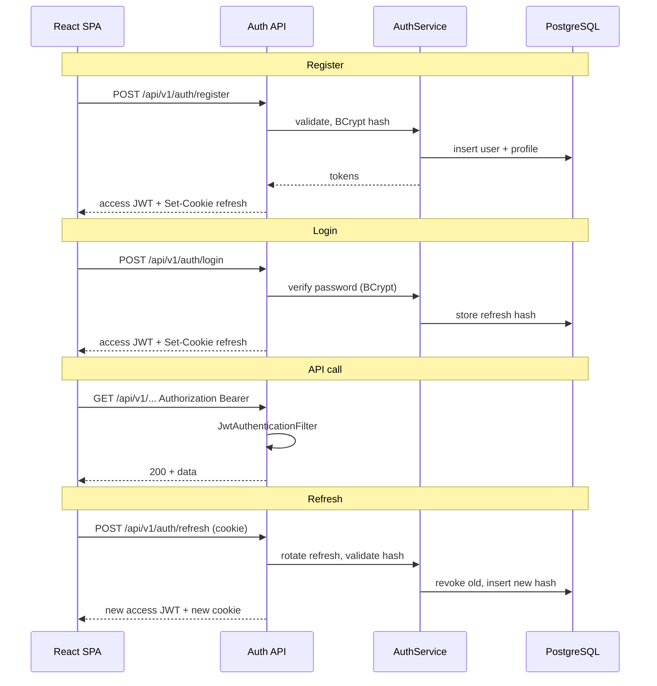

### 6.3 Security decisions

- **BCrypt** with strength 10–12 for `password_hash`.
- **Rate limit** login/register (Bucket4j or reverse proxy) — e.g. 10/min/IP.
- **Account status**: `ACTIVE`, `SUSPENDED`, `DELETED`; deleted users anonymize PII.
- WebSocket: pass JWT in **STOMP CONNECT** header or query param (prefer header); same validation as REST.

---

## 7. WebSocket flow (STOMP)

### 7.1 Why STOMP

Spring’s `spring-messaging` + STOMP gives destination-based routing (`/user/queue/messages`, `/topic/...`), heartbeats, and integrates with Spring Security messaging.

### 7.2 Connection and messaging

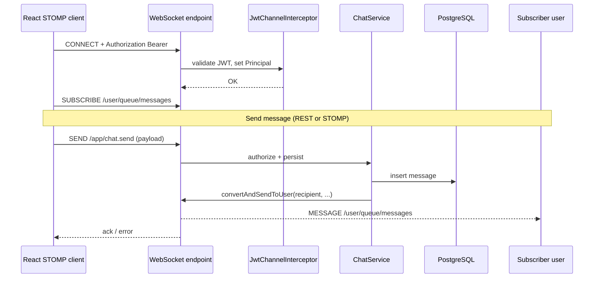

### 7.3 Destinations (convention)

| Destination | Purpose |
|-------------|---------|
| `/app/chat.send` | Client sends message (server validates connection) |
| `/user/queue/messages` | Per-user message fan-out |
| `/user/queue/notifications` | Connection events, unread bumps |
| `/topic/presence.{venueId}` | Optional future: venue presence |

**Scale-out note:** Single Render instance needs no broker. Multiple instances require **Redis pub/sub** or RabbitMQ as STOMP relay—plan interface in `WebSocketEventPublisher` now, Redis later.

---

## 8. File upload flow

### 8.1 Use cases

- Profile avatar (required for trust in discovery)
- Optional chat image attachments (Phase later; architecture ready)

### 8.2 Flow

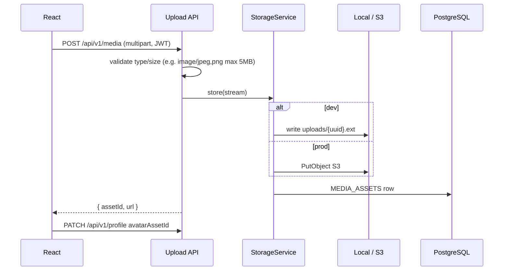

### 8.3 Security

- Allowlist MIME via Tika or content sniffing; strip EXIF if needed.
- Serve avatars via **signed URLs** (S3) or **authenticated GET** `/api/v1/media/{id}` (local dev).
- Virus scan hook (ClamAV) documented for production hardening.

**Interface:**

```java
public interface ObjectStorage {
  StoredObject put(InputStream data, String contentType, long size, UUID ownerId);
  URL getPresignedUrl(String key, Duration ttl);
  void delete(String key);
}
```

Implementations: `LocalObjectStorage`, `S3ObjectStorage`.

---

## 9. Notification flow

### 9.1 Types (v1)

| Type | Trigger | Delivery |
|------|---------|----------|
| `CONNECTION_REQUEST` | New pending request | WS + persist |
| `CONNECTION_ACCEPTED` | Target accepts | WS + persist |
| `NEW_MESSAGE` | Message saved (recipient offline or badge update) | WS + persist |

### 9.2 Pipeline

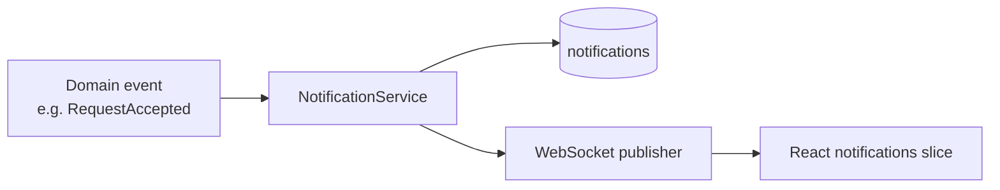

**Decision:** Synchronous notification write in same transaction as domain change (strong consistency for inbox). WebSocket publish **after commit** (`@TransactionalEventListener(phase = AFTER_COMMIT)`) to avoid ghost notifications.

REST: `GET /api/v1/notifications`, `PATCH /api/v1/notifications/{id}/read`, `POST /api/v1/notifications/read-all`.

---

## 10. Discovery & connections (architectural preview)

### 10.1 Discovery API shape

`GET /api/v1/discovery/nearby?lat=&lng=&radiusKm=5&page=&size=`

Server computes haversine or PostGIS `ST_DWithin`, applies block/opt-out filters, returns card DTOs (no exact coordinates of others unless policy allows distance band only).

### 10.2 Connection state machine

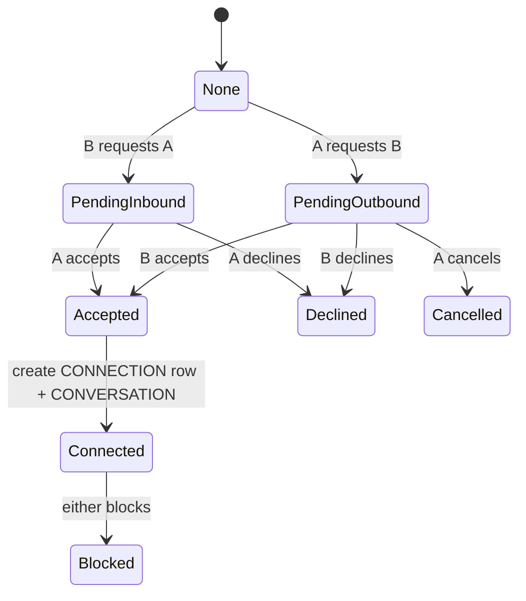

---

## 11. Security architecture (summary)

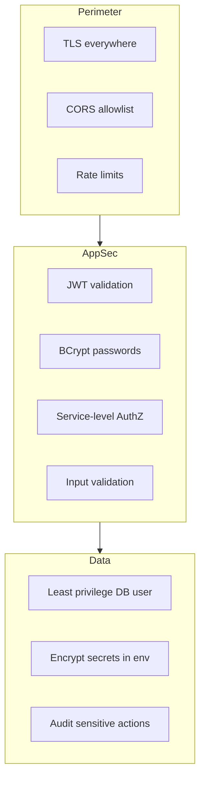

| Threat | Mitigation |
|--------|------------|
| XSS stealing tokens | httpOnly refresh; short access; CSP on Vercel |
| CSRF on cookie refresh | SameSite=Strict; double-submit or custom header |
| IDOR on chat/profile | Every query scoped by `currentUserId` |
| Scraping discovery | Auth required, pagination caps, rate limits |
| WebSocket hijacking | JWT on CONNECT; subscribe only to `/user/**` for self |

---

## 12. Deployment architecture

### 12.1 Environments

| Env | Frontend | Backend | DB |
|-----|----------|---------|-----|
| Local | `npm run dev` | Spring Boot :8080 | Docker Postgres |
| Staging | Vercel preview | Render staging | Neon branch |
| Production | Vercel prod | Render/AWS | Supabase/Neon prod |

### 12.2 Configuration

**Frontend (Vercel):** `VITE_API_URL`, `VITE_WS_URL`

**Backend:** `DATABASE_URL`, `JWT_SECRET`, `JWT_ACCESS_TTL`, `CORS_ORIGINS`, `STORAGE_MODE=local|s3`, `AWS_*` (if S3)

### 12.3 Deployment diagram

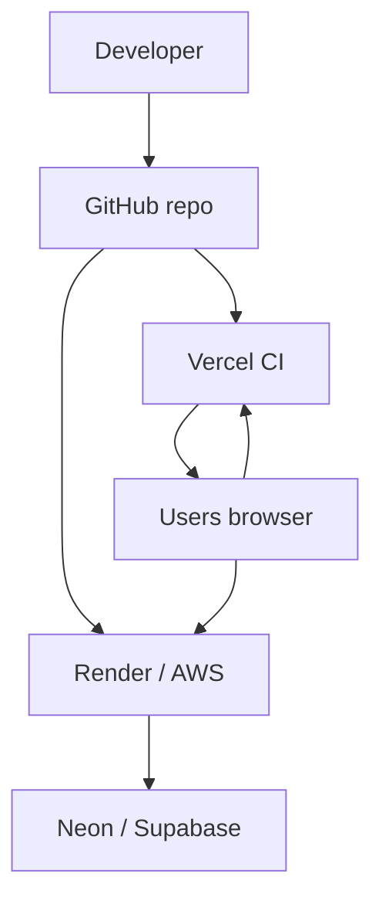

**Health checks:** Render uses `/actuator/health/liveness`; DB migration on startup (Flyway) with failure = failed deploy.

---

## 13. Testing strategy (cross-phase)

| Layer | Tool | Scope |
|-------|------|--------|
| Backend unit | JUnit 5, Mockito | Services, domain rules |
| Backend integration | `@SpringBootTest`, Testcontainers Postgres | Repositories, security |
| Backend API | MockMvc / RestAssured | Controllers + JWT |
| Frontend unit | Vitest | Reducers, hooks |
| Frontend component | React Testing Library | Forms, guards |
| E2E (later) | Playwright | Login → connect → chat |

Phase 1 exit criteria: **signed-off architecture**, ERD, API namespace, module boundaries, and flows above agreed before Phase 2 implementation.

---

## 14. Phase roadmap (after Phase 1)

| Phase | Deliverable |
|-------|-------------|
| 2 | Auth, user profile, JWT, React auth shell |
| 3 | Location update + discovery UI/API |
| 4 | Connection requests + notifications |
| 5 | Chat (REST history + STOMP live) |
| 6 | Media upload, polish, E2E, deployment runbooks |

---

## 15. Architecture decision record (ADR) snapshot

| ID | Decision | Rationale |
|----|----------|-----------|
| ADR-001 | Monolith Spring Boot | Faster delivery; shared transactions for connect+chat rules |
| ADR-002 | PostgreSQL + optional PostGIS | Geo queries native; managed on Neon/Supabase |
| ADR-003 | JWT access + refresh rotation | Stateless API scale; revocable sessions via refresh table |
| ADR-004 | STOMP WebSocket | First-class Spring support; user queues |
| ADR-005 | Storage adapter pattern | Local dev parity; S3 without code fork in services |
| ADR-006 | Feature folders in React | Scales with teams; colocate slices and pages |
| ADR-007 | Authorization in services | Prevents IDOR better than annotation-only security |

---

*Phase 1 complete. Proceed to Phase 2: implement auth, database V1 migration, and frontend app shell per this document.*
